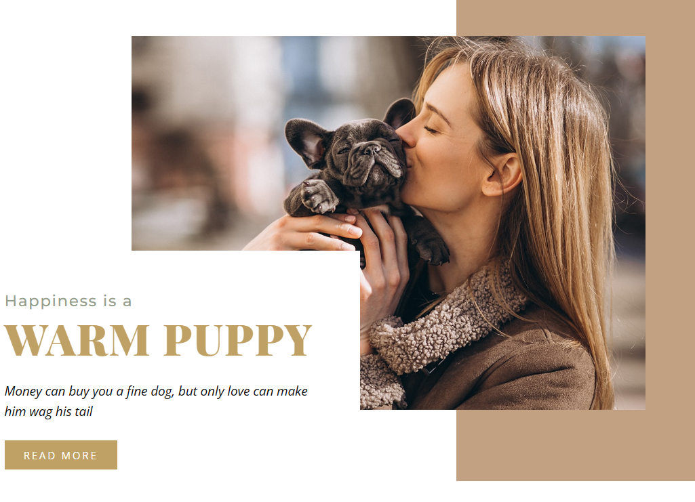

# position-2
<div align="center">


**A responsive and clean web page built entirely with pure CSS.**

[**➥ Live Demo**](https://asya948.github.io/position-1/)

</div>

---

## About the Project
A simple, minimalist website with a black-and-white background, featuring a header, grid layout, buttons, and input fields. Designed as a business card website.

✅ Built 100% with **custom CSS**  
✅ Fully responsive and beginner-friendly  
✅ Great reference for clean layout and HTML/CSS structure

---

## Demo Screenshot

![Desktop Demo]

---

## Getting Started

Make sure you have [Git](https://github.com/asya948/position-2.git) installed. Then run:

```bash
git clone 
```

---

## Want to connect?

If you'd like to connect, collaborate, or just explore more of my work:

- 🔗 **See more on GitHub**: [asya.948](https://github.com/asya948)
- 💼 **Connect with me on LinkedIn**: [My LinkedIn Profile](https://www.linkedin.com/in/asya-nersesyan-461a0937a/)

Feel free to reach out!

---

## License

This project is open-source and available under the [MIT License](LICENSE).

---
